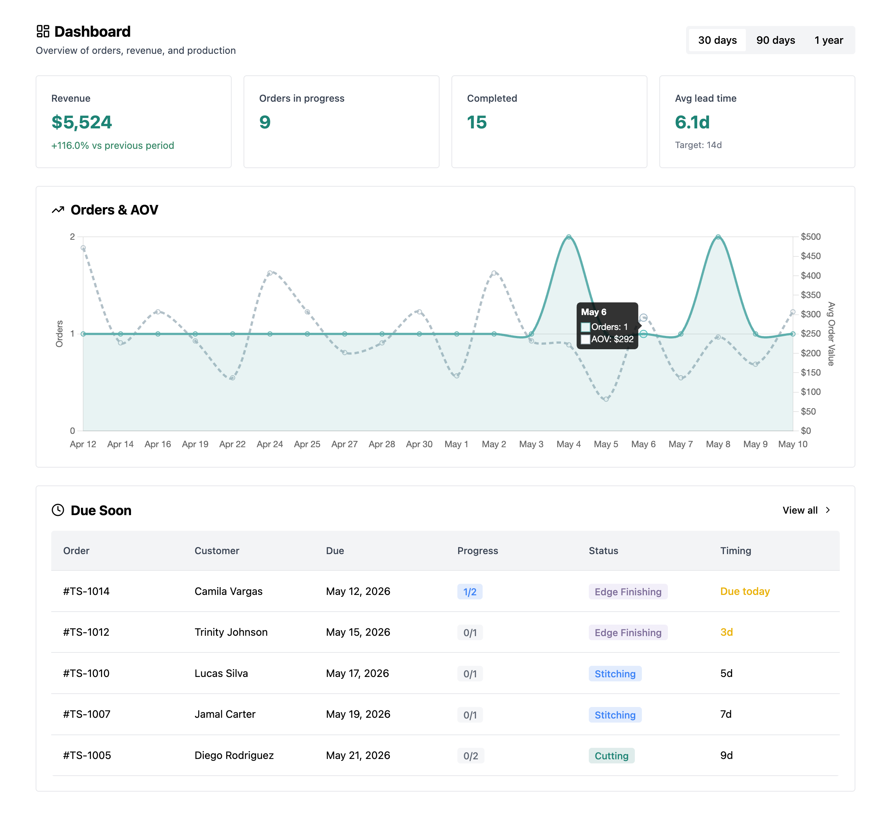
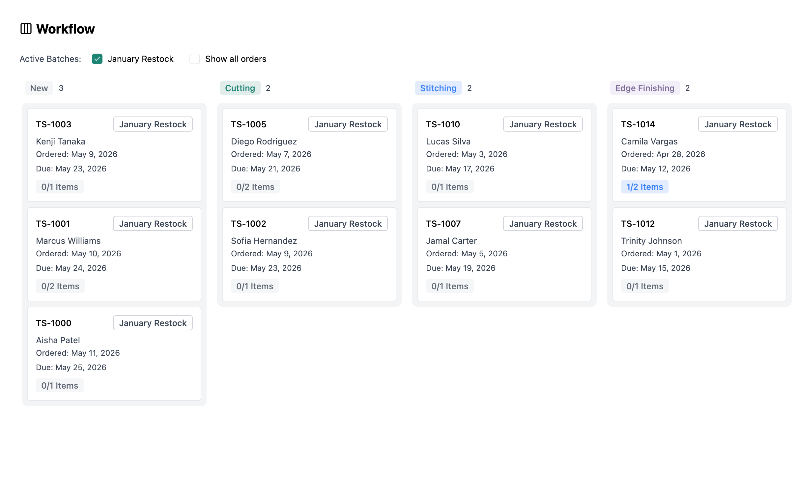
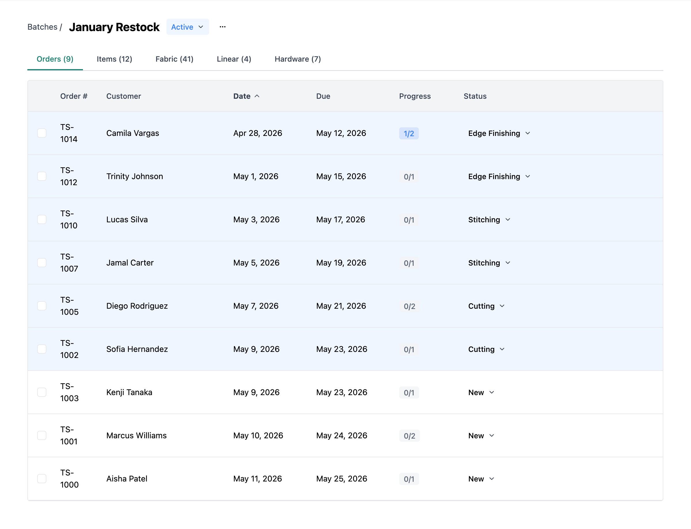
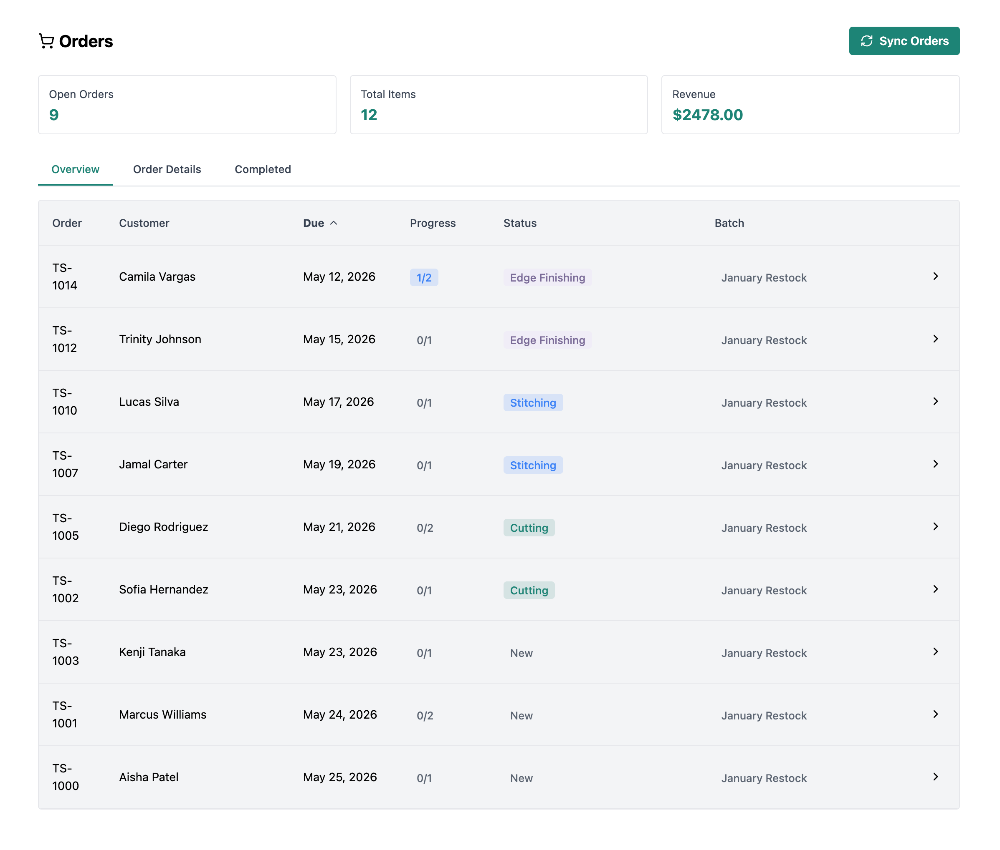
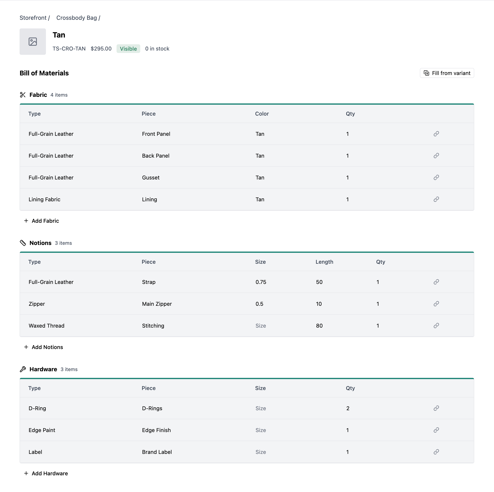

# Lemmary App

> Automated reporting for small businesses.

React dashboard for production management. Visualizes time-series KPIs, order pipelines, and aggregated materials needed for connected commerce stores.

**[Live demo →](https://lemmary.com)**

## Stack

React 19 · Vite · TypeScript · TanStack Query · Chart.js · Artifact UI · Tailwind CSS

## Outcomes

> Saves beta users 5–15 hours per week of manual reporting, depending on order volume.

- Replaces manual weekly reporting with auto-aggregated KPIs and trend analysis
- Surfaces production bottlenecks through stage tracking and overdue order indicators
- Cuts material over-ordering by aggregating exact demand across pending batches
- Speeds up fulfillment by grouping orders with shared materials into single production runs

## Highlights

- Time-series KPI dashboard with Chart.js — adaptive day / week / month bucketing across 30 / 90 / 365-day ranges
- Drag-and-drop kanban with customizable workflow stages per store
- Production batches with rolled-up items and materials demand tables
- Read-only demo mode at `/demo` so anyone can explore the full app — no signup required

## Screenshots

|                                                          |                                                             |
| -------------------------------------------------------- | ----------------------------------------------------------- |
|  |  |
|            |       |

Feature modules live in `src/features/<feature>/` — components, hooks, queries, and routes co-located per feature.

## Related

- [lemmary-api](https://github.com/rwbrockhoff/lemmary-api) — Node API

---

Built by [Artifact Studio](https://artifactstudio.dev).
